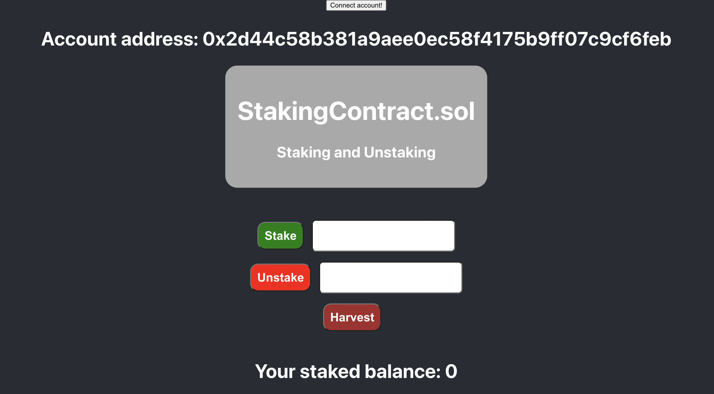
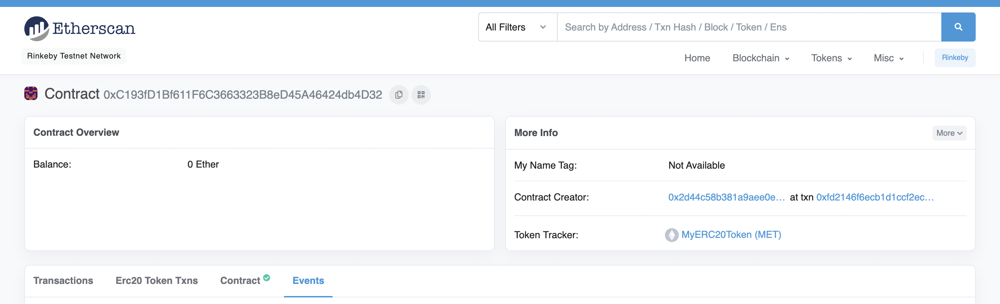
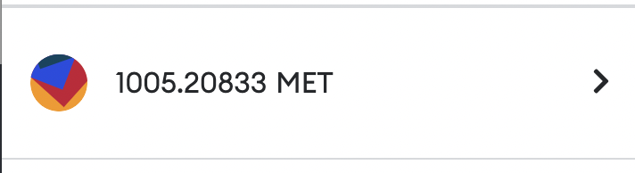
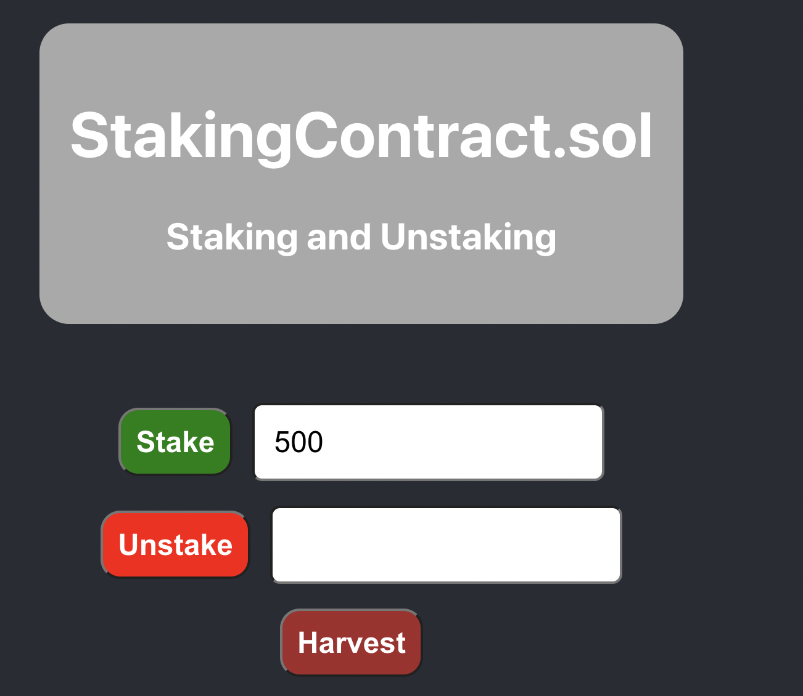
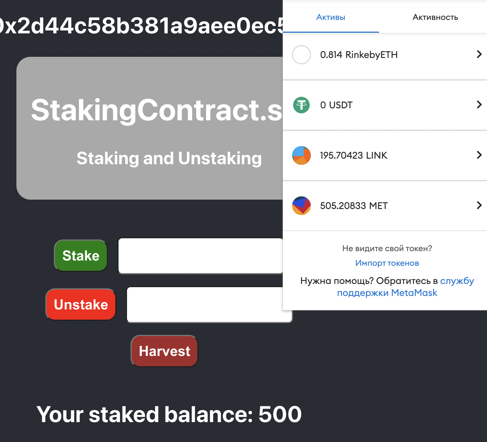
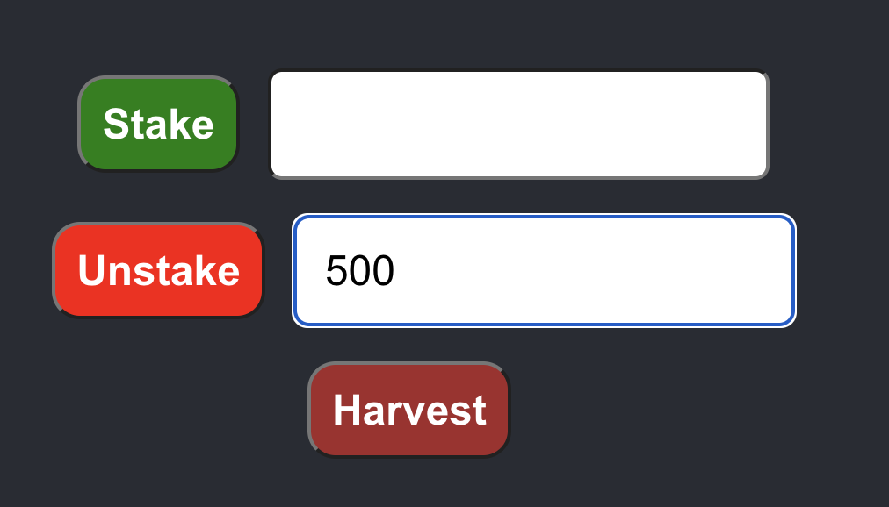
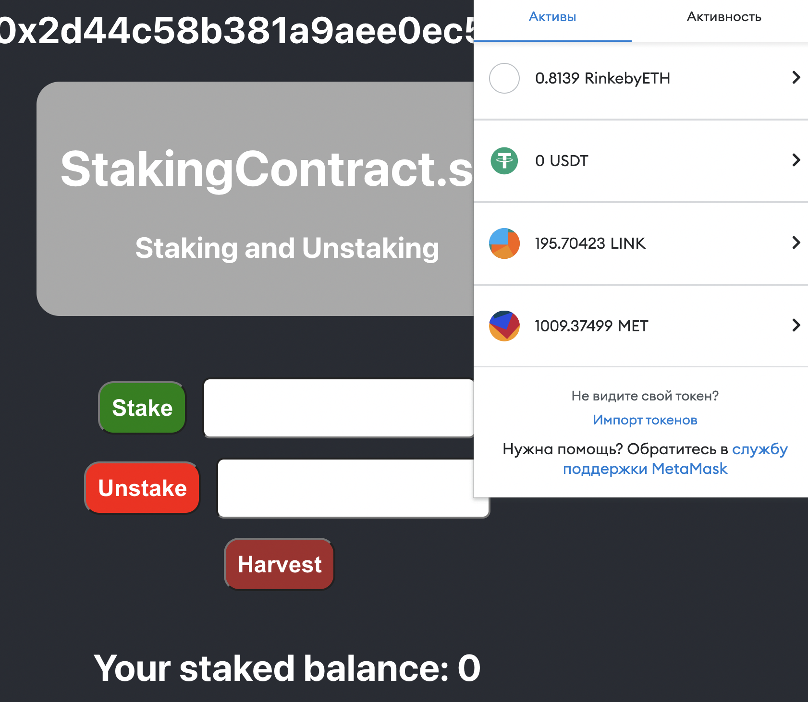

Contract was deployed in Rinkeby test network

Added token to my metamask wallet

Stake

My balance changed, it's shown in screen too

Unstake(after some time)

Tokens + approximately 4 tokens came back

